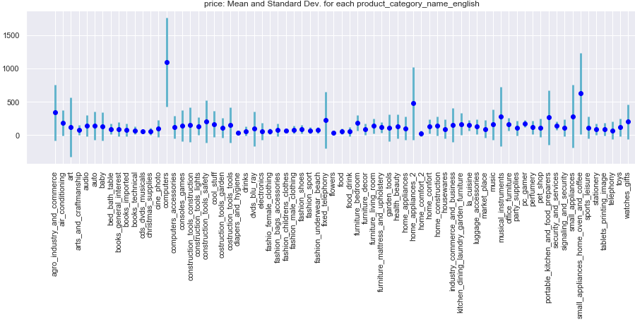

# Classification of clients
Classifications of clients in an internet shopping mall are performed via Kmeans++, TNSE, hierarchical classifications. 
The purpose is to gather clients in groups via several criteria i.e. features from 10 different dataframes and some feature engineered variables to implement a target discount strategy to each cluster of clients.
The stability of the clusters are checked by introducting fresh new clients without any pourchase history.

In the first notebook dataframes are satistically analysed and cleaned via various functions I developed to enable a fast data treatment.

Here are some examples. One can observe the frequency of purchase by month, the review score, and the product distributions.

Similarly here is the mean and standard deviation for each product.

And here one can observe the geolocation of the type of payment.

Satisfaction (based on different time information and review score) and Frequency_in_month, product_categories are the result of Feature engineering.
The first classification is performed based on the features: Satisfaction, price, pcn_Home (home products), pcn_leisure_fashion_n_beauty (products for leisure, fashion and beauty) and Frequency_in_month (purchase frequency in a month).
The second classification is performed based on the features: Satisfaction, price, geolocation and Frequency_in_month (purchase frequency in a month).
The optimal number of clusters for the first classification is 4. 

Above are the 4 clusters found by the hierarchical clustering and below by the Kmeans++ with the center of the clusters..

The first group has a low frequency of purchase and spends in average for 114 reals and more for products of leisure, fashion and beauty. 
The second group has middle frenquency of purchase and spends in average for 433 reals and mainly for home products.
The third group has high frequency of purchare and  spends in average 325  reals all the different kinds of products. This group is the most satisfied.
The fourth group has middle frenquency of purchase and spends in average for 468 reals and mainly for products of leisure, fashion and beauty.

In the second classification, 3 groups are found using 3 algorithms: hierarchical clustering, Kmeans++ and TNSE.
Below one can see the agreement between the Kmeans++ labels and the TNSE for a perplexity of 13.

Future work: perform clustering for with the feature price, payment_type (as card_payment_ration after feature engineering), satisfaction. Then decide which clustering display the most significant values related to the features and advice the marketing team. Neuronal networks can also be studied to compare their perfomance with Kmeans++, TNSE and hierarchical classification.

